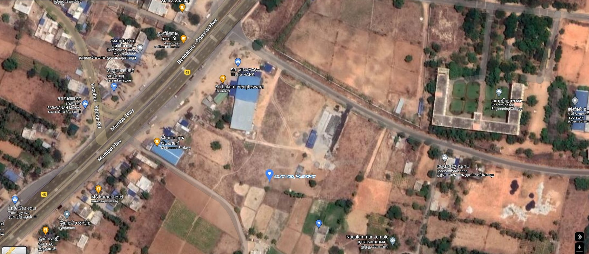
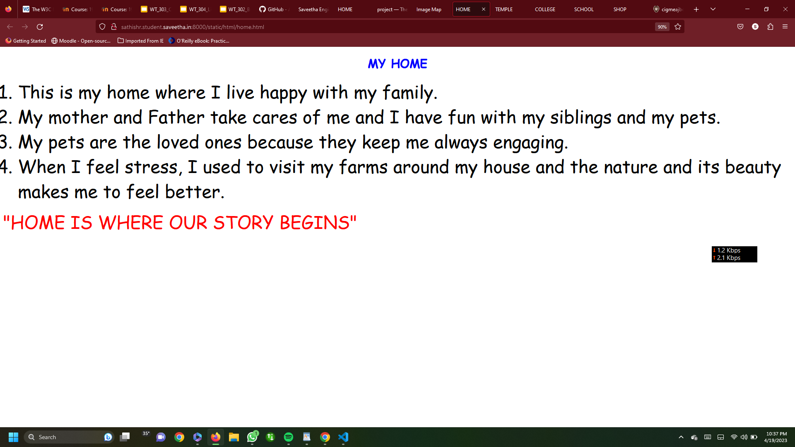

# Places Around Me
## AIM:
To develop a website to display details about the places around my house.

## Design Steps:

### Step 1:
Create a new Django project.
### Step 2:
Add a view and template to your Django project
### Step 3:
Take screenshots of places around your house using Google Maps.
https://www.google.com/maps/@13.0262105,80.0169595,304m/data=!3m1!1e3.
### Step 4:
Identify a minimum of five different locations and mark them using image maps.
https://www.image-maps.com/
### Step 5:
Develop a webpage(minimum of 50 words) for each location and link it to the image region

## Code:
index.html
```
<!DOCTYPE html>
<html>
    <head>
        <title>
            Image Map
        </title>
    </head>
    <body >
        <h1 align="center" >
            <font color="red" >
                    Image Map Of My Home Town
            </font>

            
        </h1>
        <h3 align="center">
        <font color="blue" face ="cursive">
            SATHISH R (212222100048)
        </font>
            
        </h3>
        <center>
        
        <map name="image-maps-2023-04-18-204107" id="ImageMapsCom-image-maps-2023-04-18-204107">
            <area  alt="" title="Temple" href="temple.html" shape="rect" coords="1198,726,1248,776" style="outline:none;" target="_self"     />
            <area  alt="" title="College" href="college.html" shape="rect" coords="1526,261,1576,311" style="outline:none;" target="_self"     />
            <area  alt="" title="My home" href="home.html" shape="rect" coords="963,671,1013,721" style="outline:none;" target="_self"     />
            <area  alt="" title="School" href="school.html" shape="rect" coords="404,129,454,179" style="outline:none;" target="_self"     />
            <area  alt="" title="Bakery" href="shop.html" shape="rect" coords="465,421,515,471" style="outline:none;" target="_self"     />
            <area shape="rect" coords="1826,786,1828,788" alt="Image Map" style="outline:none;" title="Image Map" href="https://www.image-maps.com/" />
        </map>

        </center>
        <p align="center">
            <font color="maroon"  face="Comic Sans MS" >
                This Image Map shows various locations around my home.<br>
                Click the location and get information about it.
            </font>
        </p>

    </body>
</html>
```
home.html
```
<!DOCTYPE html>
<html>
<head>
    <title>
        HOME
    </title>
</head>
<body >
<h1 align="center">
    <font color="blue" face="cursive">
        MY HOME
    </font>
</h1>
<p align="center">
    <font color="black" face="Comic Sans MS" size="24">
        <OL  TYPE="1" START="1">
			<LI>This is my home where I live happy with my family.<br></LI>		
			<LI>My mother and Father take cares of me and I have fun with my siblings and my pets.<br></LI>
            <LI>My pets are the loved ones because they keep me always engaging.<br></LI>
            <LI>When I feel stress, I used to visit my farms around my house and the nature and its beauty makes me to feel better.<br></LI>
		</OL>

    </font>
    <font color ="red" face = "cursive" size="16" > 
    "HOME IS WHERE OUR STORY BEGINS"
    </font>


</p>

</body>

</html>
```
## Output:



## Result:
Thus the locations are located and their informations are linked using HTML code.
